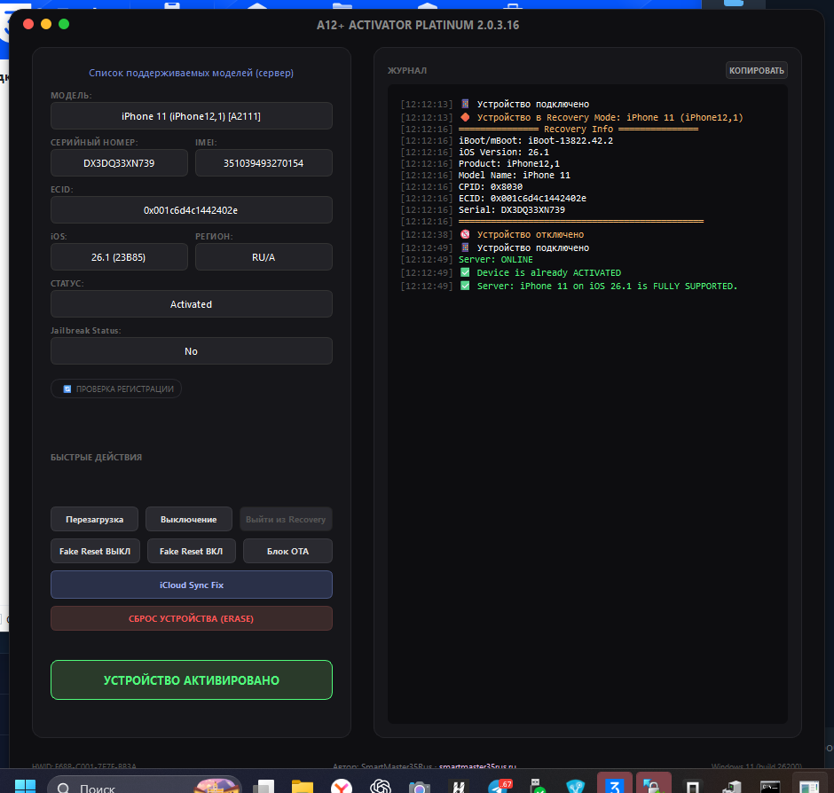

# A12+ Activator Platinum

MacOS/Win-стильный инструмент для активации iPhone и iPad, застрявших на экране приветствия (Hello Screen), под управлением Windows.

> [!WARNING]
> Все действия выполняются на ваш страх и риск. Разработчик не несет ответственности за потерю данных, повреждение устройства или юридические последствия.

  

## Возможности

- **Активация iPhone / iPad / iPod** — обход экрана «Привет» (iCloud Hello Screen)
- **Автоопределение устройства** — модель, серийный номер, IMEI, UDID, версия iOS, регион и статус активации
- **Быстрые действия** — перезагрузка, выключение, выход из Recovery, сброс, блокировка OTA-обновлений
- **Исправление iCloud-синхронизации** — мастер переноса резервной копии с донорского устройства для работы iMessage, FaceTime, App Store
- **Список поддерживаемых моделей** — актуальная таблица с сервера: какие устройства и версии iOS поддерживаются
- **Автообновление** — проверка и установка новых версий при запуске
- **Инженерное меню** (Ctrl+Shift+F11) — расширенные настройки для опытных пользователей
- **Поддержка языков** — английский, русский, испанский

## Системные требования

- **ОС:** Windows 10 (build 19041+) / Windows 11
- **Обязательно:** [3uTools](http://www.3u.com/) + iTunes из состава 3uTools (НЕ из Microsoft Store)
- USB-кабель для подключения устройства

## Поддерживаемые устройства

| Тип | Модели |
|-----|--------|
| **iPhone** | 6s / 6s Plus / SE (1st) / 7 / 7 Plus / 8 / 8 Plus / X / XR / XS / XS Max / 11 / 11 Pro / 11 Pro Max / SE (2nd) / 12 / 12 mini / 12 Pro / 12 Pro Max / 13 / 13 mini / 13 Pro / 13 Pro Max / SE (3rd) / 14 / 14 Plus / 14 Pro / 14 Pro Max / 15 / 15 Plus / 15 Pro / 15 Pro Max / 16 / 16 Plus / 16 Pro / 16 Pro Max / 16e / 17 / 17 Pro / 17 Pro Max / 17 Air |
| **iPad** | Air 2 / mini 4 / Pro 9.7 / Pro 12.9 (1st/2nd) / 5 / 6 / 7 / Pro 10.5 / Pro 11 (все поколения) / Pro 12.9 (3rd+) / Air 3 / Air 4 / Air 5 / Air 6 (M2) / Air 7 (M3) / mini 5 / mini 6 / mini 7 (A17 Pro) / M4 / M5 |
| **iPod** | 6 / 7 |

### Поддержка iOS

| Статус | Версии |
|--------|--------|
| Поддерживаются | iOS 14 — 18.7.2 |
| Поддерживаются | iOS 26.0 — 26.1 beta 1 |
| Не поддерживаются | iOS 18.7.3+ |
| Не поддерживаются | iOS 26.1 beta 2+ |

> [!NOTE]
> Устройства китайского региона (CH/A, CN/A) могут требовать RJ45-адаптер или Apple Configurator.

## Быстрый старт

1. Установите 3uTools + iTunes из комплекта 3uTools
2. Подключите устройство по USB (экран «Привет» должен быть активен, Wi-Fi подключён)
3. Запустите A12 Activator Platinum
4. Дождитесь определения устройства
5. Нажмите **ACTIVATE DEVICE**
6. Следуйте инструкциям на экране

## Контакты

- Поддержка: [t.me/SmartMaster35Rus](https://t.me/SmartMaster35Rus)
